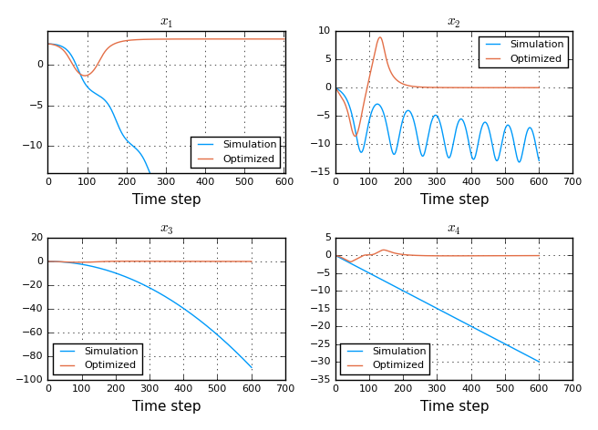
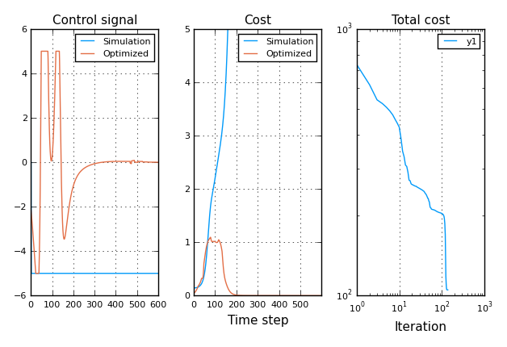

# DifferentialDynamicProgramming

[](http://pkg.julialang.org/?pkg=DifferentialDynamicProgramming)
[](http://pkg.julialang.org/?pkg=DifferentialDynamicProgramming)
[](http://pkg.julialang.org/?pkg=DifferentialDynamicProgramming)
[](https://travis-ci.org/baggepinnen/DifferentialDynamicProgramming.jl)

[](https://coveralls.io/github/baggepinnen/DifferentialDynamicProgramming.jl?branch=master)


## Demo functions
The following demo functions are provided


`demo_linear()`     To run the iLQG DDP algorithm on a simple linear problem  
`demoQP`            To solve a demo quadratic program  
`demo_pendcart()`   Where a pendulum attached to a cart is simulated.


## Usage
### Demo linear
See demo file `demo_linear.jl` for a usage example.

```julia
# make stable linear dynamics
h = .01         # time step
n = 10          # state dimension
m = 2           # control dimension
A = randn(n,n)
A = A-A'        # skew-symmetric = pure imaginary eigenvalues
A = exp(h*A)   # discrete time
B = h*randn(n,m)

# quadratic costs
Q    = h*eye(n)
R    = .1*h*eye(m)

# control limits
lims = [] #ones(m,1)*[-1 1]*.6

T    = 1000             # horizon
x0   = ones(n,1)        # initial state
u0   = .1*randn(m,T)    # initial controls

# optimization problem
N    = T+1
fx   = A
fu   = B
cxx  = Q
cxu  = zeros(size(B))
cuu  = R

# Specify dynamics functions
function lin_dyn_df(x,u,Q,R)
    u[isnan(u)] = 0
    cx  = Q*x
    cu  = R*u
    fxx=fxu=fuu = []
    return fx,fu,fxx,fxu,fuu,cx,cu,cxx,cxu,cuu
end
function lin_dyn_f(x,u,A,B)
    u[isnan(u)] = 0
    xnew = A*x + B*u
    return xnew
end

function lin_dyn_cost(x,u,Q)
    c = 0.5*sum(x.*(Q*x)) + 0.5*sum(u.*(R*u))
    return c
end

f(x,u,i)     = lin_dyn_f(x,u,A,B,Q,R)
costfun(x,u) = lin_dyn_cost(x,u,Q)
df(x,u)      = lin_dyn_df(x,u,Q,R)
# plotFn(x)  = plot(squeeze(x,2)')

# run the optimization

@time x, u, L, Vx, Vxx, cost, otrace = iLQG(f,costfun ,df, x0, u0, lims=lims);
```


### Demo pendulum on cart
If [ControlSystems.jl](https://github.com/JuliaControl/ControlSystems.jl) is installed, there is an additional demo function `demo_pendcart()`, where a pendulum attached to a cart is simulated. In this example, regular LQG control fails in stabilizing the pendulum at the upright position due to control limitations. The DDP-based optimization solves this by letting the pendulum fall, and increases the energy in the pendulum during the fall such that it will stay upright after one revolution.





This code consists of a port and extensions of a MATLAB library provided by the autors of
BIBTeX:
@INPROCEEDINGS{
  author={Tassa, Y. and Mansard, N. and Todorov, E.},
  booktitle={Robotics and Automation (ICRA), 2014 IEEE International Conference on},
  title={Control-Limited Differential Dynamic Programming},
  year={2014}, month={May}, doi={10.1109/ICRA.2014.6907001}}
  http://www.mathworks.com/matlabcentral/fileexchange/52069-ilqg-ddp-trajectory-optimization
  http://www.cs.washington.edu/people/postdocs/tassa/
